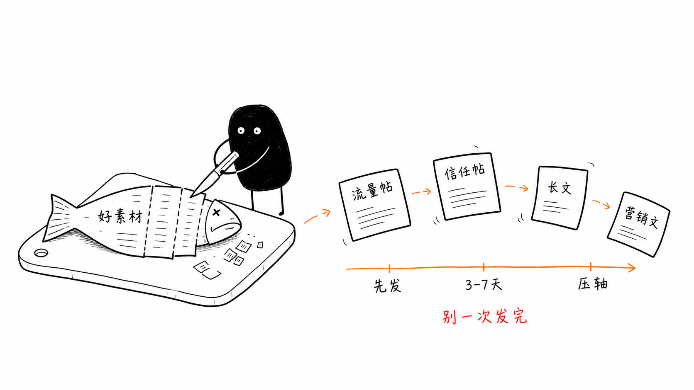
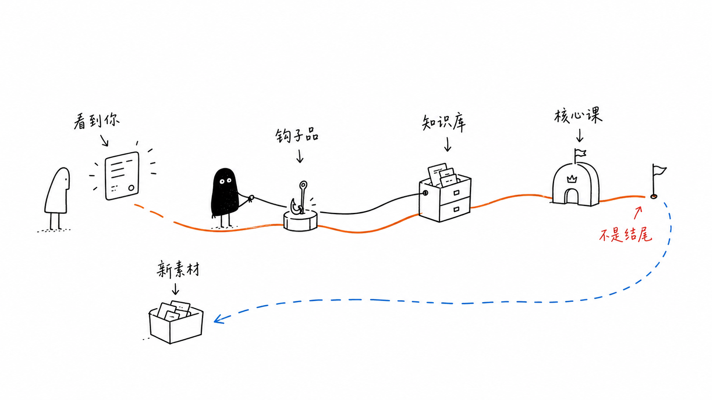

# Xiaohei Illustrations Skill

A portable agent skill that turns the judgments, flows, states, and metaphors in an article into white-background, hand-drawn, quirky-but-clean inline illustrations.

**16:9 · Xiaohei character · pure-white hand-drawn · sparse red/orange/blue English labels**

It is not a generic illustration prompt and not a PPT-infographic template. The skill first finds the **cognitive anchors** in an article, then turns one judgment, flow, structure, state, or metaphor into a memorable hand-drawn explanatory figure starring **Xiaohei**: a small, solid-black creature with white dot eyes, thin legs, and a blank deadpan face that performs the core action rather than decorating the scene.

This is an English adaptation of [Ian's](https://github.com/helloianneo) original Chinese Codex skill, [`ian-xiaohei-illustrations`](https://github.com/helloianneo/ian-xiaohei-illustrations). See [NOTICE.md](NOTICE.md) for attribution.

## What This Skill Helps With

Use `xiaohei-illustrations` when you want to:

- Plan where an article, blog post, or doc should be illustrated (a **shot list** of cognitive anchors).
- Generate inline illustrations in a consistent hand-drawn, deadpan style.
- Reinvent a fresh low-tech visual metaphor per idea instead of reusing stock compositions.
- De-title or edit a generated figure (e.g. remove a stray top-left title).

It deliberately avoids commercial illustration, PPT infographics, formal flowcharts, cute cartoons, and dense explainer layouts.

## Requirements

Claude Code has no built-in image generator. This skill is **tool-agnostic**: it calls whatever image-generation tool is available in your environment (an MCP image tool or an image-generation CLI). If none is available, it runs in **planning mode** — producing the shot list and ready-to-paste prompts for you to run in your own image tool.

## Direct npx Install

Install directly from this repo. Codex:

```bash
npx --yes github:pde201/skills/skills/cognition/xiaohei-illustrations codex
```

Claude Code:

```bash
npx --yes github:pde201/skills/skills/cognition/xiaohei-illustrations claude
```

Custom skills directory:

```bash
npx --yes github:pde201/skills/skills/cognition/xiaohei-illustrations --dest "$HOME/.agents/skills"
```

If the skill is already installed, add `--force`.

## Clone-Based Install

```bash
gh repo clone pde201/skills
cd skills/skills/cognition/xiaohei-illustrations
./install.sh claude        # or: ./install.sh codex
```

Installs to `${CLAUDE_HOME:-$HOME/.claude}/skills/xiaohei-illustrations` (or the Codex equivalent). Restart your agent afterward so it can discover the skill.

## Verify Installation

```bash
ls "${CLAUDE_HOME:-$HOME/.claude}/skills/xiaohei-illustrations/SKILL.md"
```

Then invoke it by describing the task — no slash command needed:

```text
Generate 4 Xiaohei illustrations for the article below.

<paste article>
```

## How It Works

1. Digest the article and extract cognitive anchors (key judgment, input→output loop, before/after, common pitfalls, handoff path, state change).
2. Lead with a shot list (default 4–8 images): placement, theme, core idea, structure type, what Xiaohei is doing, suggested English labels.
3. Generate each image separately via the available image tool, using `references/prompt-template.md`.
4. QA against `references/qa-checklist.md`; regenerate or locally edit on failure signals.
5. Save finals to `assets/<article-slug>-illustrations/` and report purpose, paths, and which are solid vs optional.

## Repository Layout

```text
.
+-- SKILL.md
+-- README.md
+-- NOTICE.md
+-- LICENSE
+-- install.sh
+-- package.json
+-- bin/install.js
+-- references/
|   +-- style-dna.md
|   +-- character.md
|   +-- composition-patterns.md
|   +-- prompt-template.md
|   `-- qa-checklist.md
`-- examples/
    +-- prompts.md
    `-- images/          # style-calibration gallery (original Chinese-labeled art)
```

## Style Gallery

These are **style-calibration** samples (line density, white space, color restraint, Xiaohei's vibe), not composition templates — and they carry Chinese labels from the original skill, whereas this English skill produces English labels. Always reinvent the metaphor from the current article.

| | |
|---|---|
|  |  |
|  |  |

## Notes

- The shorter the in-image text, the more stable it generates.
- One image, one core structure — don't make the article a manual.
- If removing Xiaohei leaves the image fully intact, Xiaohei was too decorative — make it the subject of the action.
- Image models can produce typos, hallucinated labels, style drift, or extra titles — always QA after generating.

## Credits

English Claude Code adaptation of [`ian-xiaohei-illustrations`](https://github.com/helloianneo/ian-xiaohei-illustrations) by **Ian (伊恩)**. Licensed MIT — see [LICENSE](LICENSE) and [NOTICE.md](NOTICE.md).
